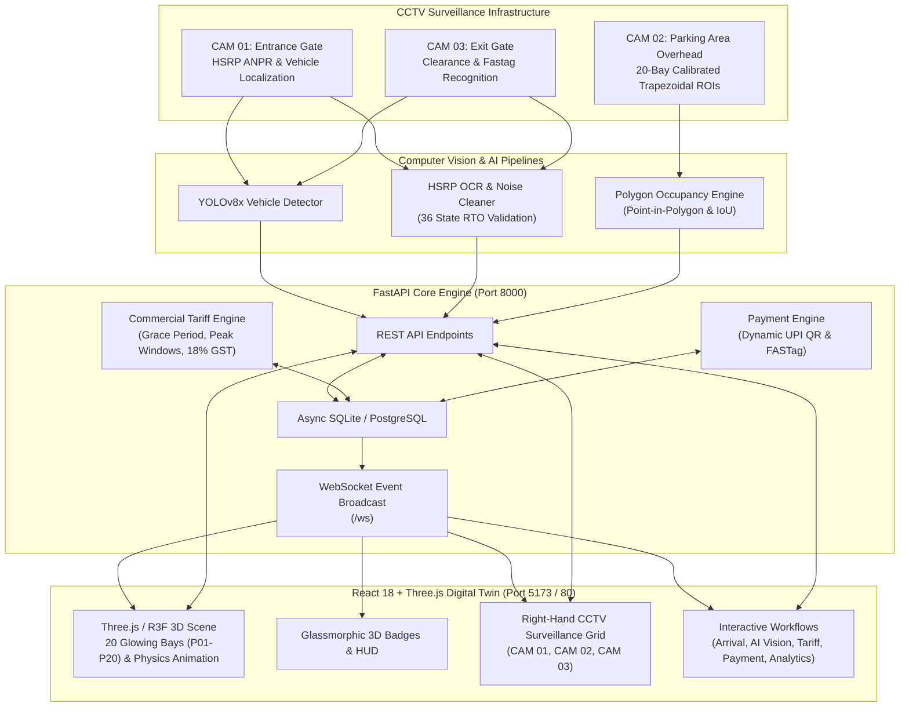

# Vision-Based Intelligent Parking Occupancy & Management System

[](https://fastapi.tiangolo.com)
[](https://react.dev)
[](https://threejs.org)
[](https://tailwindcss.com)
[](https://www.docker.com)
[](https://pytest.org)

An enterprise-grade, real-time AI-powered Smart Parking Control System and Digital Twin. Combines **Three.js WebGL 3D Visualization** with **Computer Vision (Indian HSRP ANPR, YOLO, Calibrated Polygon Occupancy ROIs)**, **FastAPI + Async SQLAlchemy Backend**, **Tiered Tariff Billing Engine**, **Dynamic UPI QR Settlement**, and **Live CCTV Multi-Camera Surveillance Grid**.

---

## System Architecture



---

## Key Technical Features

### 1. Interactive 3D WebGL Digital Twin (Three.js / React Three Fiber)
- **20 Individually Identifiable Parking Bays**: `P01` to `P10` (Top Row) and `P11` to `P20` (Bottom Row) with neon boundary glow indicators:
  - 🟢 **Available** (`#10b981`)
  - 🔴 **Occupied** (`#ef4444`)
  - 🟡 **Reserved** (`#f59e0b`)
- **Realistic 3D Elements**: Guard booths, asphalt driveway with directional arrows, road curbs, boundary walls, streetlights with realistic night illumination cones, trees, and CCTV camera mounting poles.
- **Physical Vehicle Driving Animations**:
  - `EnteringVehicleAnimation`: Vehicles smoothly turn through the entrance gate, drive along the central aisle, rotate into their assigned bay, and park.
  - `ExitingVehicleAnimation`: Departing vehicles pull forward out of the bay, steer eastward, approach the exit barrier, trigger automatic boom barrier arm release, and depart the lot.
- **Camera Controls & Presets**: Smooth animated transitions with hotkey navigation (`R` Orbit Reset, `T` Top-down 2D, `I` Isometric, `1` Entrance View, `2` Exit View, `Esc` Deselect).

### 2. Multi-Camera AI Computer Vision Grid
- **CAM 01 — Entrance Gate**: Live 1080P 60FPS feed viewfinder, vehicle localization bounding box, High Security Registration Plate (HSRP) OCR with 36 State RTO validations, and plate crop image preview.
- **CAM 02 — Parking Area (Overhead)**: 20 perspective-calibrated trapezoidal polygon ROIs, Point-in-Polygon centroid detection (`cv2.pointPolygonTest`), IoU overlap classifier, and laser scanning line animation.
- **CAM 03 — Exit Gate**: Optical vehicle tracking, license plate identification, active session lookup, duration calculation, and FASTag clearance.

### 3. Commercial Tariff & Billing Engine
- **Tiered Vehicle Rates**:
  - *Standard Sedan*: Base ₹30 (1st hr) + ₹20/hr (Daily Max ₹250)
  - *Full-size SUV*: Base ₹40 (1st hr) + ₹25/hr (Daily Max ₹300)
  - *Compact Hatchback*: Base ₹25 (1st hr) + ₹15/hr (Daily Max ₹200)
  - *Two-Wheeler*: Base ₹15 (1st hr) + ₹10/hr (Daily Max ₹100)
- **15-Minute Free Transit Grace Period**: Vehicles departing within 15 minutes are waived from all charges ($₹0.00$).
- **Dynamic Peak Hour Surcharge**: $1.25\times$ multiplier applied during morning (09:00–11:30 AM) and evening (05:00–08:30 PM) congestion windows.
- **Statutory Taxation**: Itemized 18% GST (9% CGST + 9% SGST).

### 4. Dynamic Multi-Method Payment Gateway
- **Dynamic UPI QR Code**: Generates RFC-compliant `upi://pay` strings and scannable QR codes with live expiry countdown timers.
- **NHAI FASTag Auto-Debit**: Instant RFID simulated toll deduction with automatic gate clearance.
- **Point-of-Sale Card & Cash**: Operator clearance options.
- **Automated Gate Interlock**: Verified payment automatically signals the physical boom barrier arm to open and clears the 3D parking bay.

### 5. Operational Analytics & KPI Intelligence
- **Recharts Data Visualizations**:
  - Hourly Revenue Progression Bar Chart
  - Diurnal Occupancy Progression Gradient Area Chart
  - Fleet Vehicle Class Distribution Donut Chart
- **Operational Metrics**: 20-Slot Matrix, Turnover Rate ($1.6\times$), Efficiency Score ($94.2\%$), Average Dwell Time, and searchable Active/Historical Session Ledger.

---

## 18-Phase Implementation Log

| Phase | Milestone Description | Status |
|:-----:|:----------------------|:------:|
| **1** | Project Architecture, folder structure, and tech stack setup | ✅ Completed |
| **2** | 3D WebGL Parking Environment (ground, asphalt, curbs, walls, lighting) | ✅ Completed |
| **3** | Calibrated 20-Bay Parking Grid (`P01` – `P20`) with glowing boundary markers | ✅ Completed |
| **4** | 3D Vehicle Models, reference fleet color matching, and bay occupancy | ✅ Completed |
| **5** | Smooth Camera Rig, Hotkey Navigation (`R`, `T`, `I`, `1`, `2`), and 3D HUD Badges | ✅ Completed |
| **6** | FastAPI Backend Architecture, REST API Routers, and WebSocket Hub | ✅ Completed |
| **7** | Database Layer (SQLAlchemy ORM + SQLite Async fallback / PostgreSQL) | ✅ Completed |
| **8** | Frontend-to-Backend Real-Time Synchronization (REST + WebSocket events) | ✅ Completed |
| **9** | Physical 3D Vehicle Arrival Animation and Slot Assignment Workflow | ✅ Completed |
| **10**| Indian HSRP ANPR / OCR Recognition Engine & Plate Crop Generator | ✅ Completed |
| **11**| CAM 02 AI Overhead Vision, 20 Trapezoidal ROIs, and Point-in-Polygon Scanner | ✅ Completed |
| **12**| Physical 3D Vehicle Exit Navigation, CAM 03 Clearance, and Barrier Arm Trigger | ✅ Completed |
| **13**| Commercial Tariff Engine, Grace Period Waiver, Peak Surcharges, and GST | ✅ Completed |
| **14**| Dynamic UPI QR Generator, FASTag Auto-Debit, and Multi-Method Payment Modal | ✅ Completed |
| **15**| Operational Analytics Dashboard, Recharts Visualizations, and Sessions Ledger | ✅ Completed |
| **16**| Right-Hand Live CCTV Monitoring Sidebar (CAM 01, CAM 02, CAM 03) | ✅ Completed |
| **17**| Automated Test Suite (32/32 Pytest Cases Passing) & Error Resilience | ✅ Completed |
| **18**| Multi-Stage Dockerfiles, Nginx Reverse Proxy, and Docker Compose Orchestration | ✅ Completed |

---

## Getting Started

### Method 1: Docker Compose (Recommended for Production)

Run the entire system (Database, Backend, and Frontend) in isolated containers with a single command:

```bash
# Clone the repository
git clone <repository-url>
cd "car parking"

# Start the full Docker stack
docker compose up --build
```

- **Frontend Application**: `http://localhost:5173` or `http://localhost:80`
- **FastAPI Backend**: `http://localhost:8000`
- **Interactive OpenAPI Swagger Docs**: `http://localhost:8000/docs`

---

### Method 2: Local Development Setup

#### Prerequisites
- **Node.js** (v18 or v20+) & **npm**
- **Python** (v3.10, v3.11, or v3.13)
- Windows / Linux / macOS

#### 1. Backend Setup
```bash
# In project root
python -m pip install -r backend/requirements.txt

# Start FastAPI server with live reload
python -m uvicorn backend.app.main:app --host 127.0.0.1 --port 8000 --reload
```

#### 2. Frontend Setup
```bash
# Navigate to frontend folder
cd frontend

# Install dependencies
npm install

# Start Vite development server
npm run dev -- --host
```

#### 3. One-Click Launch (Windows)
Double-click `start_dev.bat` in the project root to automatically launch both servers in separate terminal windows.

---

## Automated Test Suite

Run the full automated pytest suite:

```bash
# In project root
python -m pytest backend/tests -v --tb=short
```

Or execute `run_tests.bat`.

### Test Summary
```text
backend/tests/test_anpr_engine.py .....          [PASS]
backend/tests/test_api_endpoints.py ..........   [PASS]
backend/tests/test_billing_service.py .....      [PASS]
backend/tests/test_error_handling.py .......     [PASS]
backend/tests/test_occupancy_ai.py ...           [PASS]
backend/tests/test_parking_lifecycle_e2e.py .    [PASS]

====================== 32 passed in 1.59s ======================
```

---

## API Documentation Summary

| Method | Endpoint | Description |
|:-------|:---------|:------------|
| `GET` | `/health` | Healthcheck endpoint (`{"status": "healthy"}`) |
| `GET` | `/api/parking/slots` | Retrieves real-time status & coordinates for all 20 bays |
| `GET` | `/api/parking/slots/{id}` | Retrieves details for a specific bay (`P01` – `P20`) |
| `GET` | `/api/parking/status` | Summary of total, occupied, available, and reserved counts |
| `GET` | `/api/parking/tariff` | Official tariff rates, vehicle tiers, peak windows, and GST |
| `POST`| `/api/parking/calculate-fee` | Computes itemized receipt and parking fee breakdown |
| `POST`| `/api/vehicles/entry` | Registers vehicle arrival, allocates bay, and triggers barrier |
| `POST`| `/api/vehicles/exit` | Initiates vehicle departure, fee calculation, and payment check |
| `GET` | `/api/vehicles/history` | Historical and active sessions ledger with search and filters |
| `POST`| `/api/payment/create` | Generates dynamic UPI QR order and payment ID |
| `POST`| `/api/payment/verify` | Verifies settlement, clears slot, and releases exit barrier |
| `GET` | `/api/dashboard/stats` | Comprehensive fleet analytics, revenue trends, and KPIs |
| `GET` | `/api/cameras` | Real-time surveillance metadata for CAM 01, CAM 02, and CAM 03 |
| `POST`| `/api/ai/plate-recognition`| Indian HSRP ANPR and OCR frame processing pipeline |
| `POST`| `/api/ai/occupancy-scan` | Evaluates CAM 02 20-slot calibrated polygon occupancy |
| `WS`  | `/ws` | Real-time bidirectional WebSocket event stream |

---

## Keyboard Shortcuts in 3D Scene

- `R` — Reset to default orbital perspective
- `T` — Top-Down 2D overhead camera
- `I` — Isometric angled surveillance perspective
- `1` — Focus on Entrance Gate (CAM 01)
- `2` — Focus on Exit Gate (CAM 03)
- `Esc` — Deselect active parking bay / camera
- `Click on any Bay` — Inspect vehicle details and 3D coordinates
